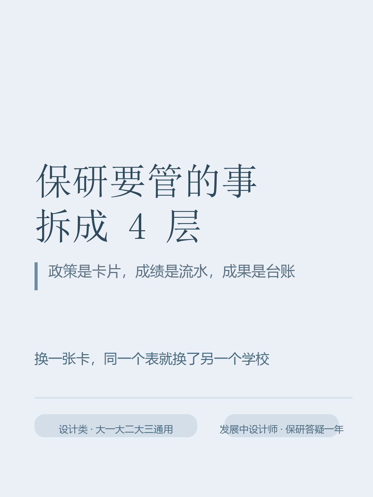

# 设计保研工作台 · Design Portfolio Workbench

一个给设计类本科生用的保研自我管理工具。**单文件 HTML，零依赖，双击即用，离线可跑，数据不出本机。**

作者：高艺云 · 小红书 [@发展中设计师](https://www.xiaohongshu.com/user/profile/6050b52e000000000100903f)

---

## 为什么做这个

我在做保研答疑的一年里，被反复问同样的问题：

- 我这个排名稳不稳？
- 我们学校竞赛到底加几分？
- 专利算不算？
- 团队第 3 名和第一名差多少？
- 作品集几个项目够？

这些问题的答案一半压在本校的《推免工作实施办法》里，一半压在自己攒的奖状上。
市面上的保研内容大多是经验帖，**没有一个地方能让人"把自己的情况放进去算出结果"**。

所以我把保研要管的事拆成四层，做成一张能自己改的表。

## 四层结构（也是这个工具的设计核心）

| 层 | 内容 | 设计决策 |
|---|---|---|
| **政策层** | 学校权重、加分档位、绩点换算、名次折算 | **做成可替换的「政策卡」**，一套学校一张，换卡即换学校。这是整个工具可复用的关键 |
| **成绩层** | 每门课一行，自动算加权绩点 | 支持 PDF/txt 导入，但**导不进来的绝不硬来** |
| **成果层** | 竞赛 / 论文 / 专利 / 大创 / 互联网+ / 挑战杯 | 团队名次自动折算（第 1 名 1/2、第 2 名 1/4…） |
| **投递层** | 院校 / 入营 / 结果 / 面试真题 | 自动算命中率，替代"我感觉投了不少" |

## 七个模块

| 模块 | 功能 |
|---|---|
| 总览 | 综合得分圆环、排名安全度、一键生成可复制的进度小结 |
| ① 我的政策 | 多套政策卡并存可切换；**粘贴政策文本自动识别权重与加分档位** |
| ② 成绩与绩点 | 导入 PDF/txt 成绩单或手工录入；自动算加权绩点 |
| ③ 加分台账 | 按类别 + 等次 + 团队名次自动折分，分类上限 100 |
| ④ 作品集与科研 | 项目追踪（目标 4~6 个）+ 科研四步路径 |
| ⑤ 时间轴与材料 | 大一大二大三 17 条任务 + 14 项材料清单（含盖章提醒） |
| ⑥ 投递看板 | 入营 / 结果 / 面试真题，自动统计命中率 |

## 技术上的几个点

- **单文件交付**：一个 `.html` 就是全部，没有构建步骤、没有后端、没有账号体系。目标是让非技术用户（学弟学妹）拿走就能用
- **零依赖浏览器端**：不引框架，状态存 `localStorage`，靠事件委托 + 按需重绘保住可维护性
- **规则引擎化**：加分档位、权重、绩点换算表、名次折算全部可编辑，不写死任何一家学校的规则
- **数据持久化**：`localStorage` + 导出 JSON 备份，跨设备/跨浏览器不互通（隐私优先，也刻意没做多人协作）
- **打印 / 存 PDF**：内置 print 样式，可直接导出成 PDF 当存档

## 开发过程中真正解决的三个问题

**1. 政策规则不能写死**
一开始想直接把本校公式塞进去，但这样工具就只是"某校专用"。改成把政策抽成可替换的卡片，并支持从公文文本里自动识别——**识别只负责筛行、捞数字，分值一律留给人工核对**，不做无根据的猜测。

**2. 成绩单三栏并排时取错成绩**
最初按"一行里 40~100 之间最大的数"当成绩，结果三栏并排的表格里这条规则会抓到隔壁课程的成绩（例如 `色彩 12 92 48.0 商业插画 3 90 4.0 ...` 会记成"成绩 95、学分 90"）。
改成**分组解析**：用正则把一行切成若干「数字组」，组内取最大，课程名取该组前最近的中文片段。改完 21 门课全部正确。

**3. 图片型成绩单没有文字层**
实测发现教务系统导出的成绩单很多是纯图片（0 个可解码字符、0 个字体）。浏览器端抽不出文字，本地又装不了 OCR 依赖。
结论不是假装能自动，而是**改通路**：提示用户走「复制文字 / 存 txt / 手工录入」，并在 UI 里写清失败原因。工具诚实比工具全能更重要。

## 使用方法

1. 下载仓库里的 `index.html`，双击用 Chrome / Edge 打开
2. 先填 5 个数字：年级、学校、专业、总人数、当前排名
3. 「① 我的政策」：把本校《推免工作实施办法》里讲"综合成绩构成"和"加分标准"的两段话粘进去 → 识别 → 核对 → 应用
4. 「② 成绩与绩点」：导入成绩单或一行一门手工录
5. 「③ 加分台账」：把奖状记进来，填"团队第几名 / 几个人"

> 政策页自动识别出的分值，**一定要按你本校当年官方文件人工核对**。

## 数据隐私

没有服务器、没有账号、不上传任何数据。数据存在浏览器 localStorage 里，按"设备 + 浏览器"隔离。
它不是多人协作表——要看别人的进度，用「总览 → 全选复制」那段文字小结。

## 已知边界

- 政策页「粘贴政策文本识别」需要联网（在线调 pdf.js），断网会给出明确提示
- 图片型（扫描件）成绩单没有文字层，浏览器端抽不出来，需手工录入
- 成绩单 PDF 导入同样要求"有文字层"

## 版本

- **v1.0** 总览 + 政策卡（多套并存 / 文本自动识别）+ 成绩绩点 + 加分台账 + 作品集科研 + 时间轴材料 + 投递看板
- **v1.1** 成绩单 PDF/txt 导入；政策识别改为分组解析（修复三栏并排取错成绩）；政策页改为可选路径
- **v1.2** 总览新增可复制的「进度小结」，用于把填表结果回传给帮忙解析的人

## 开源协议

MIT。可以随便改、随便用，但请保留原作者署名。

## 作者

高艺云 · 湖南大学设计艺术学院 2026 级 · 小红书 [@发展中设计师](https://www.xiaohongshu.com/user/profile/6050b52e000000000100903f)

如果这个项目帮到了你，或者你想聊聊设计生怎么做自己的小工具，欢迎在小红书找我。
